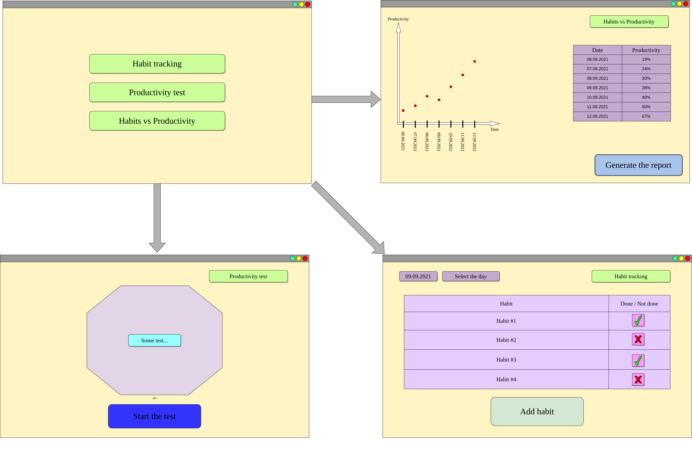

# biproductive

[](https://app.codacy.com/gh/rizvansky/biproductive?utm_source=github.com&utm_medium=referral&utm_content=rizvansky/biproductive&utm_campaign=Badge_Grade_Settings)

## Description

This repository created for application BiProductive, needed for analysing habits of person and listing most useful
habits, that makes human happy. Each day user enters which actions user made today (sport activity, playing music, etc.)
, test his brain activity, and program analyses it and make personal recommendation, based on weekly results.

BiProductive allows the user to analyze their performance together with habit usage to evaluate the effect of each
habit. Each day user enters which actions they performed today (sport activity, playing music, etc.), test his brain
activity, and program analyses it and make personal recommendation, based on weekly results.

- The application is deployed on Heroku: https://biproductive.herokuapp.com

## Authors

-  Shamil Arslanov, Rizvan Iskaliev, Maxim Faleev

## Link to artifact: [link](https://docs.google.com/document/d/14AMeCV4WJotkQ8lvZcl2u_bB66lMKmu4/edit?usp=sharing&ouid=109541784549585358096&rtpof=true&sd=true)

## Stack of technology

-  Django as a backend of application (can be easily deployed and most team members are in touch with this framework)
-  PostgreSQL as a database (it is fast and all team members have experience with this database)
-  Brighton as a backend for productivity checker game
-  html, css as a front-end for web-application

## How to launch the application
-  go to the project folder
-  rename .env.example to .env and fulfill the variables
-  put .env file to ```biproductive/biproductive/.env``` path
-  run ```docker-compose up --build```

## How to deploy to the Heroku
- Register on Heroku if you are not registered (https://signup.heroku.com/) 
- Install required packages with ```pip install -r requirements.txt```
- Install Heroku CLI (https://devcenter.heroku.com/articles/heroku-cli)
- Login to Heroku terminal by ```heroku login```
- Create heroku app by ```heroku create``` or ```heroku create <app_name>``` for custom name of the application
- Run ```heroku git:remote -a <app_name>```
- Open ```settings.py``` file and modify ```ALLOWED_HOSTS``` by adding ```<app_name.herokuapp.com>```
- Commit changes
- Create PostgreSQL database on Heroku by ```heroku addons:create heroku-postgresql:hobby-dev```
- Go to ```https://dashboard.heroku.com/apps/<app_name>/settings``` and click on the ```Reveal Config Vars``` and copy 
  the ```DATABASE URL```. It has the following structure: 
  ```postgres://<DB_USER>:<DB_PASSWORD>@<DB_HOST>:<DB_PORT>/<DB_NAME>```
- Set these variables as Heroku environment variables below ```DATABASE_URL``` with the keys ```DB_USER```,
  ```DB_PASSWORD```, ```DB_HOST```, ```DB_PORT```, ```DB_NAME``` and the values retrieved from the ```DATABASE_URL```
- Add the ```SECRET_KEY``` environment variable and set it to some value
- Add the ```DISABLE_COLLECTSTATIC``` environment variable and set it to 1
- Add the ```HEROKU``` environment variable and set it to 1
- if you are on a main branch then run ```git push heroku main```, otherwise run 
  ```git push heroku <branch_name>:main```
## Low fidelity prototype of application
