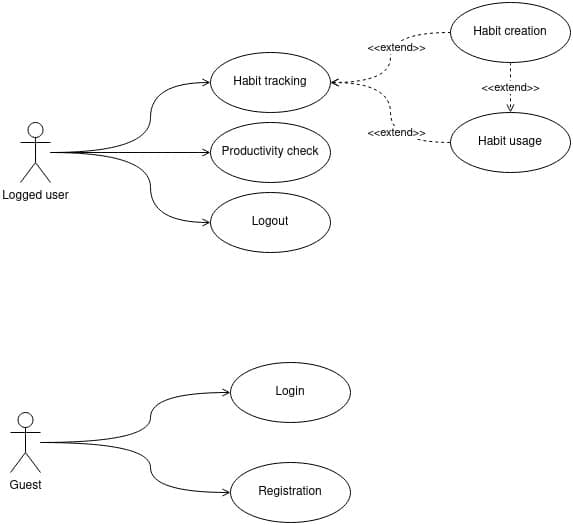
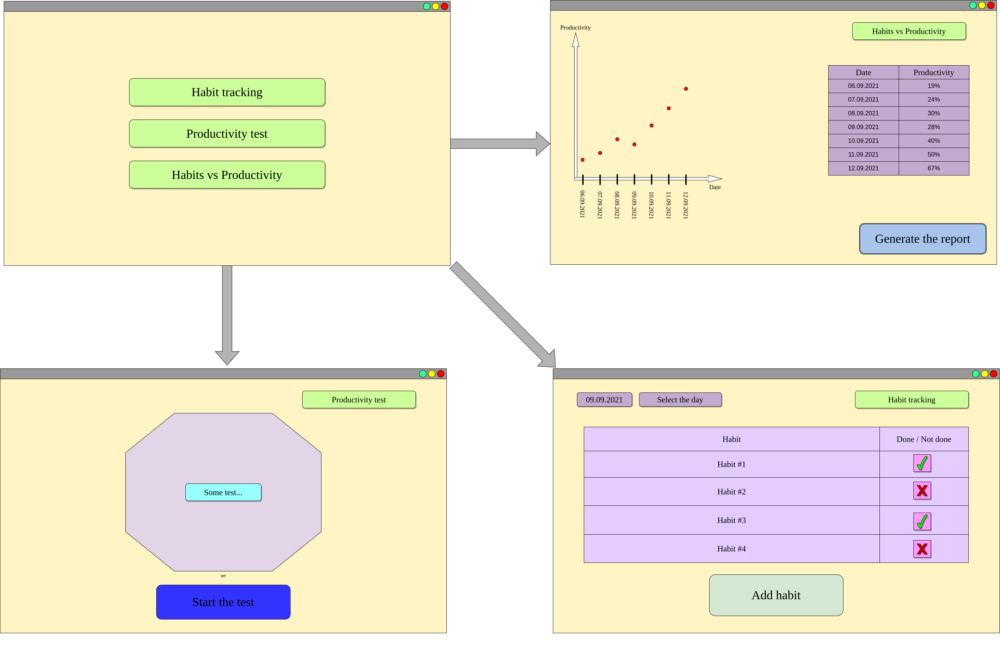
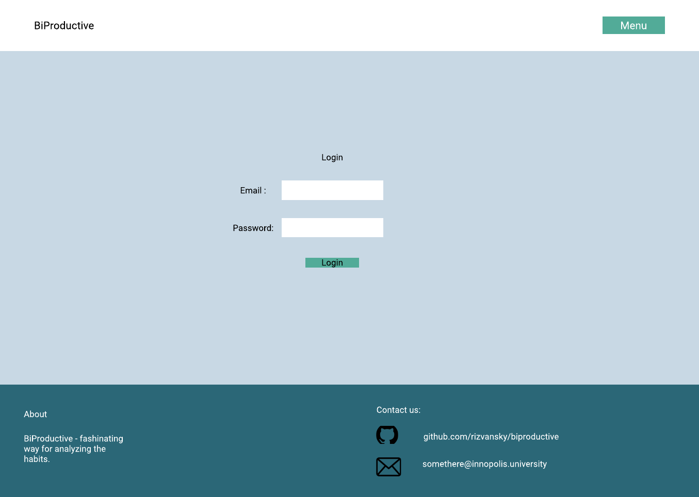
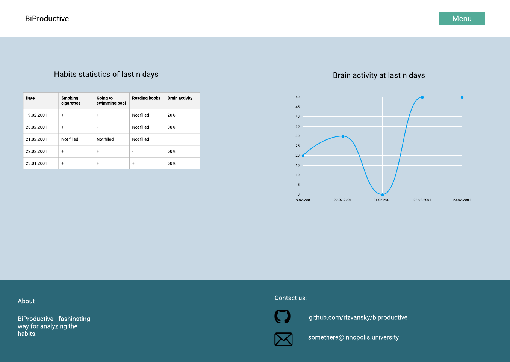

# Design development process
## Timeline
### 25.08.2021. Created a use case diagram
We planned that the logged-in user would have three options: go to the habit tracking page, go to the productivity check
page, or log out. It was assumed that on the habit tracking page, the user could create the habits and look at their 
usage.

The guest user could proceed to the login or registration pages.

### 01.09.2021. Created a [sketch of an application design](../docs/design_sketch.pdf)
### 06.09.2021. Created a low fidelity prototype of an application
Initially, in the low-quality prototype, it was assumed that we would have the main page from which you can go to 3 
other pages
* Habit tracking
* Productivity test
* Correlation analysis on productivity and habits

We assumed that the habits page would contain a usage table, the productivity test page would contain a brain 
performance game, the productivity page will contain a graph and a table. We also assumed that there would be the 
possibility of creating a report.

### 25.09.2021. Created a high fidelity prototype of an application
* Login page

It was assumed that the user would be able to log in by email and password

 

* Home page

Compared to the low-fidelity prototype, the structure has changed a little and on the main page we will have all the 
main statistics of the user for the last few days

